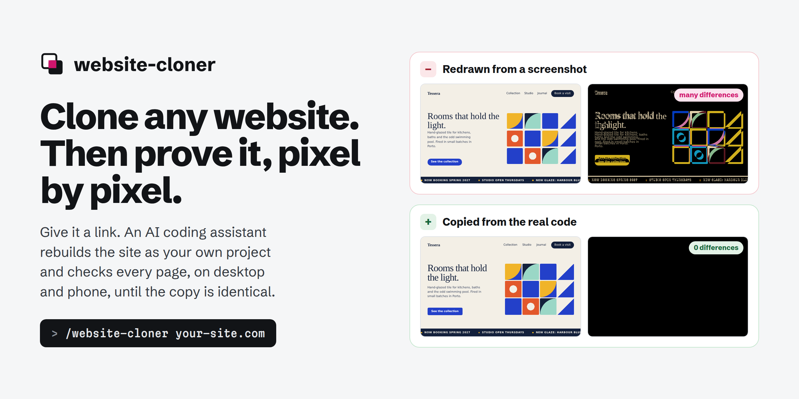
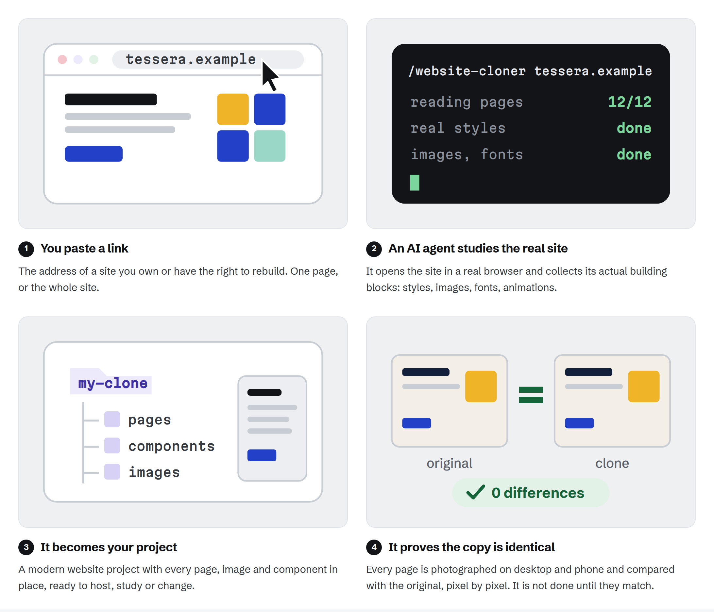
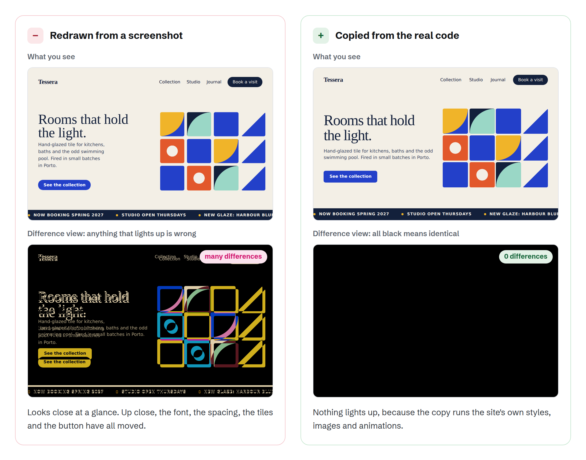
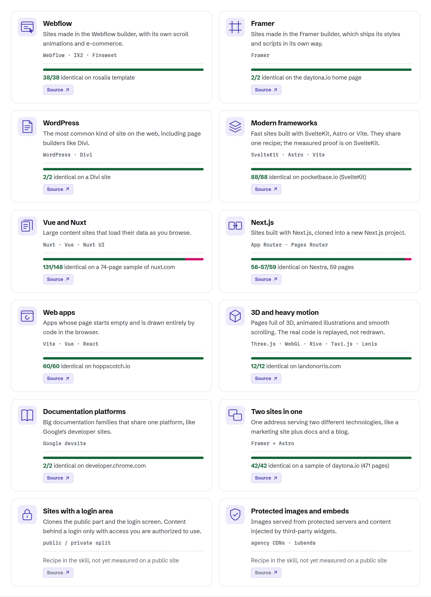
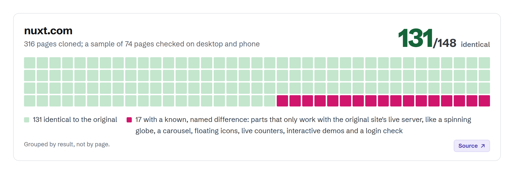
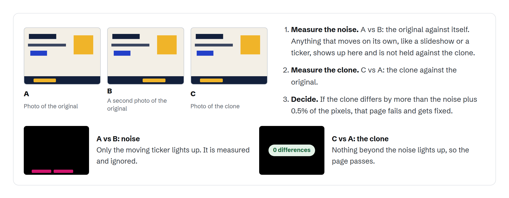

<p align="center">
  <picture>
    <source media="(prefers-color-scheme: dark)" srcset="docs/assets/banner-dark.png">
    
  </picture>
</p>

<p align="center">
  <a href="LICENSE"></a>
  
  
  
</p>

<h1 align="center">website-cloner</h1>

<p align="center">
  Clone any website. Then prove it, pixel by pixel.<br>
  Give it a website address. An AI coding assistant rebuilds that site as a modern project you own,<br>
  then compares the copy with the original, page by page, on desktop and on phone, until they match.
</p>

<p align="center">
  <a href="https://website-cloner-dev.vercel.app"><b>Project page (English and Portuguese)</b></a> ·
  <a href="#get-started">Get started</a> ·
  <a href="#built-for-every-kind-of-site">Site types</a> ·
  <a href="#for-engineers">For engineers</a> ·
  <a href="#license">License</a>
</p>

## In one minute

<picture>
  <source media="(prefers-color-scheme: dark)" srcset="docs/assets/readme/minute-dark.png">
  
</picture>

## Most cloners redraw. This one copies.

<picture>
  <source media="(prefers-color-scheme: dark)" srcset="docs/assets/readme/versus-dark.png">
  
</picture>

Other AI tools look at a screenshot and rebuild something similar. website-cloner takes the
site's real building blocks (its compiled styles, markup, images, fonts and scripts), so there is
nothing to guess. Animations, 3D and smooth scrolling are replayed from the site's own code
instead of being recreated. *The page above is a synthetic demo drawn for this project.*

## Built for every kind of site

<picture>
  <source media="(prefers-color-scheme: dark)" srcset="docs/assets/readme/types-dark.png">
  
</picture>

Each kind of website is built differently under the hood. The skill recognizes which one it is
looking at and follows the recipe for that kind. Most recipes are proven on a real site; the last
two are not measured yet. The full table with sources is in [Proven on](#proven-on).

## Tested on real, complex websites

<picture>
  <source media="(prefers-color-scheme: dark)" srcset="docs/assets/readme/nuxt-dark.png">
  
</picture>

Each square is one page checked at one screen size. The 17 named differences are parts that only
work with the original site's live server, like a spinning globe, live counters or a login check.

## How the check works

<picture>
  <source media="(prefers-color-scheme: dark)" srcset="docs/assets/readme/gate-dark.png">
  
</picture>

"Looks the same" is not good enough. Every page is photographed on desktop (1440×900) and phone
(390×844). Two photos of the original measure what moves on its own, like a slideshow; the clone
fails if it differs by more than that noise plus 0.5% of the pixels. A second check confirms every
page has exactly the same text as the original, and you get a report per page, with any leftover
difference named.

## Who it is for

| Built for | Not for |
|---|---|
| **Moving your own site:** it lives in WordPress, Webflow or Squarespace and you want it as code you fully own. | **Pretending to be someone else:** no phishing, fake sites or anything that breaks the law. |
| **Recovering lost code:** the site is online but the code is gone, or the person who built it left. | **Taking credit for someone's design:** logos, brand and original texts belong to their owners. |
| **Learning:** see how great websites build their layouts and animations, in real code. | **Ignoring a site's rules:** some sites forbid copying their pages. Check their terms first. |

## Get started

You need **Git**, **Node.js 24 or newer**, **Google Chrome** and an AI coding agent: **Claude
Code** (recommended, with Opus) or **Codex CLI**. Everything runs on your machine.
Not technical? Hand steps 1 to 3 to a developer; step 4 is the part you read.

**1. Download your copy.** Paste these into the terminal, one at a time. The first downloads the
project into a new folder called `my-clone`; the second installs what it needs.

```bash
git clone https://github.com/ogabrielalonso/website-cloner.git my-clone
cd my-clone && npm install
```

**2. Open it in your agent.** This starts Claude Code inside your copy, with access to Chrome so
it can look at the site.

```bash
claude --chrome
```

Claude Code asks once to approve the `chrome-devtools` browser tool that comes with the project
(`.mcp.json`). In Codex, register the same server once in `~/.codex/config.toml` (Codex does not
read `.mcp.json`); the project instructions live in `AGENTS.md`.

**3. Run the skill** with the address of a site you own or have the right to rebuild:

```
/website-cloner https://your-site.com
```

Give the home page and it clones the whole site, every page. Give one specific page and it
clones just that page.

**4. Read the report, not the screenshots.** At the end you get which pages were cloned, whether
the project builds, and the result of the check for every page on desktop and phone, with any
leftover difference named.

---

## For engineers

### Requirements

| For | What you need |
|---|---|
| Runtime | [Node.js](https://nodejs.org/) 24+ |
| Git | To download the project |
| Browser | [Google Chrome](https://www.google.com/chrome/); reconnaissance drives a real browser through the `chrome-devtools` MCP |
| Agent | [Claude Code](https://docs.anthropic.com/en/docs/claude-code) (recommended, Opus) or [Codex CLI](https://github.com/openai/codex) (supported) |
| The gate | Playwright and pixelmatch, lazy-installed into a shared cache on the first gate run |

### How it works

The `/website-cloner` skill runs the phases in order, autonomously. Everything
deterministic is a committed script under `scripts/` that costs zero tokens.

| Phase | What happens | Scripts |
|---|---|---|
| 0. Bootstrap | Scaffold the clone workspace | `bootstrap-clone.sh` |
| 1. Reconnaissance | Enumerate every route, detect the stack, sweep interactions, save a baseline screenshot of every route on desktop and mobile | `enumerate-routes.mjs`, `capture-routes.sh` |
| 2. Foundation | Fonts, colors, globals and every asset, including each srcset variant | `css-collector.mjs`, `css-descope.mjs`, `extract-asset-urls.mjs`, `download-assets.mjs` |
| 3. Port or specify | Markup-port slices each route's real body and script order; component-rebuild writes a spec per section | `slice-routes.mjs`, `close-js-graph.mjs` |
| 4. Build and assemble | Builder agents in parallel git worktrees, merged by the orchestrator | |
| **5. Pixel-diff gate** | **Every route, desktop and mobile, against a measured noise floor** | **`qa-diff.mjs`** |
| 6. Structure pass | Tokenize the stylesheet with an equivalence proof; distill `DESIGN.md` and `design-tokens.json` | `tokenize-css.mjs`, `extract-design-system.mjs` |
| 7. Componentize | One React component per section, shared sections deduped, DOM byte-identical | `componentize-routes.mjs`, `extract-section.mjs` |
| 8. Production output | Semantic tokens with a Tailwind `@theme`, sections transpiled to JSX, then both gates again | `verify-content-fidelity.mjs` |

Nothing after phase 5 runs until the gate passes, and every later phase re-runs it.

#### The gate

`qa-diff.mjs` captures every route at 1440x900 and 390x844 for the clone and the
original. The original is captured twice in a row, so canvases,
marquees and counters count as noise instead of defects:

```
noise  = diff(original A, original B)
signal = diff(clone, original A)
delta  = signal - noise        flag the route when delta > 0.005
```

Captures wait for `document.fonts.ready` and scroll the page so reveals settle.
`--manifest` covers every route the port produced, a 4xx/5xx fails the route, and
if the original goes offline the gate diffs against the baselines saved in phase 1.
After componentizing, `verify-content-fidelity.mjs` adds a second gate that
compares each route's visible text byte for byte with the original HTML.

#### Choose a strategy

| Strategy | You get | Trade-off |
|---|---|---|
| markup-port | A running, pixel-perfect replica: real body HTML plus the real scripts replayed in order | Frozen output; editing means editing markup |
| component-rebuild | Editable React components built from extracted specs, driven toward the original by the gate | "Faithful with named residuals", slower and pricier; class-soup sites rebuild poorly |
| replica + `extract-section` | The replica, plus any section pulled on demand into a named component | The proven answer when both matter |

### Stack recipes

The skill detects the stack first (generator tag, script and asset paths, scoping attributes) and
then follows the recipe for that kind of site.

| Kind of site | Stacks | Proven on | Source |
|---|---|---|---|
| Webflow | Webflow, IX2, Finsweet | rosalia template, 38/38 identical | [SKILL.md:171](https://github.com/ogabrielalonso/website-cloner/blob/master/.claude/skills/website-cloner/SKILL.md#L171) |
| Framer | Framer | daytona.io home page, 2/2 | [SKILL.md:227](https://github.com/ogabrielalonso/website-cloner/blob/master/.claude/skills/website-cloner/SKILL.md#L227) |
| WordPress | WordPress, Divi | a Divi site, 2/2 | [SKILL.md:261](https://github.com/ogabrielalonso/website-cloner/blob/master/.claude/skills/website-cloner/SKILL.md#L261) |
| Modern frameworks | SvelteKit (Astro and Vite share the recipe) | pocketbase.io (SvelteKit), 88/88 | [SKILL.md:242](https://github.com/ogabrielalonso/website-cloner/blob/master/.claude/skills/website-cloner/SKILL.md#L242) |
| Vue and Nuxt | Nuxt, Vue, Nuxt UI | nuxt.com, 131/148 on a 74-route sample | [SKILL.md:248](https://github.com/ogabrielalonso/website-cloner/blob/master/.claude/skills/website-cloner/SKILL.md#L248) |
| Next.js, cloned into Next.js | App Router, Pages Router | Nextra, 56 to 57/59 | [SKILL.md:210](https://github.com/ogabrielalonso/website-cloner/blob/master/.claude/skills/website-cloner/SKILL.md#L210) |
| Web apps drawn in the browser | Vite, Vue, React SPAs | hoppscotch.io, 60/60 | [SKILL.md:216](https://github.com/ogabrielalonso/website-cloner/blob/master/.claude/skills/website-cloner/SKILL.md#L216) |
| 3D and heavy motion | Three.js, WebGL, Rive, Taxi.js, Lenis | landonorris.com, 12/12 | [SKILL.md:158](https://github.com/ogabrielalonso/website-cloner/blob/master/.claude/skills/website-cloner/SKILL.md#L158) |
| Documentation platforms | Google devsite | developer.chrome.com, 2/2 | [SKILL.md:256](https://github.com/ogabrielalonso/website-cloner/blob/master/.claude/skills/website-cloner/SKILL.md#L256) |
| Two stacks behind one domain | Framer + Astro | daytona.io (471 routes), 42/42 on a stratified sample | [SKILL.md:231](https://github.com/ogabrielalonso/website-cloner/blob/master/.claude/skills/website-cloner/SKILL.md#L231) |
| Sites with a login area | public/private split, authorized session injection | recipe, not yet measured on a public site | [SKILL.md:271](https://github.com/ogabrielalonso/website-cloner/blob/master/.claude/skills/website-cloner/SKILL.md#L271) |
| Protected assets and embeds | hotlink-protected CDNs, embed-injected content | recipe, not yet measured on a public site | [SKILL.md:194](https://github.com/ogabrielalonso/website-cloner/blob/master/.claude/skills/website-cloner/SKILL.md#L194) |

### Proven on

Each stack recipe in the skill was folded in after a real clone passed the gate.
A pair is one route at one viewport. Results as recorded in the skill; the
per-pair reports stay in each clone's workspace.

| Site | Stack | Gate | Source |
|---|---|---|---|
| nuxt.com | Nuxt + Vue, 316 routes, 74-route stratified gate | 131/148 pixel-perfect, 17 named residuals | [SKILL.md:248](https://github.com/ogabrielalonso/website-cloner/blob/master/.claude/skills/website-cloner/SKILL.md#L248) |
| daytona.io | Framer + Astro hybrid, 471 routes, stratified gate | 0/42 flagged | [SKILL.md:231](https://github.com/ogabrielalonso/website-cloner/blob/master/.claude/skills/website-cloner/SKILL.md#L231) |
| pocketbase.io | SvelteKit, 44 routes | 0/88 flagged | [SKILL.md:242](https://github.com/ogabrielalonso/website-cloner/blob/master/.claude/skills/website-cloner/SKILL.md#L242) |
| hoppscotch.io | Client-rendered SPA, 30 routes | 0/60 flagged | [SKILL.md:216](https://github.com/ogabrielalonso/website-cloner/blob/master/.claude/skills/website-cloner/SKILL.md#L216) |
| rosalia template | Webflow Ecommerce + IX2 | 0/38 flagged | [SKILL.md:171](https://github.com/ogabrielalonso/website-cloner/blob/master/.claude/skills/website-cloner/SKILL.md#L171) |
| landonorris.com | Webflow, WebGL, Rive, Lenis | 0/12 flagged | [SKILL.md:158](https://github.com/ogabrielalonso/website-cloner/blob/master/.claude/skills/website-cloner/SKILL.md#L158) |
| Nextra | Next.js App Router, 59 routes | 56 to 57/59 pixel-perfect | [SKILL.md:210](https://github.com/ogabrielalonso/website-cloner/blob/master/.claude/skills/website-cloner/SKILL.md#L210) |
| developer.chrome.com | Google devsite | 0/2 flagged | [SKILL.md:256](https://github.com/ogabrielalonso/website-cloner/blob/master/.claude/skills/website-cloner/SKILL.md#L256) |
| threejs.org/examples | Canvas-only WebGL | 0/2 flagged | [SKILL.md:223](https://github.com/ogabrielalonso/website-cloner/blob/master/.claude/skills/website-cloner/SKILL.md#L223) |
| A Divi site | WordPress + Divi | 0/2 flagged | [SKILL.md:261](https://github.com/ogabrielalonso/website-cloner/blob/master/.claude/skills/website-cloner/SKILL.md#L261) |

On orchestration cost: in an isolated A/B on the same site, Sonnet held fidelity
(0/42 flagged) but cost $45.59 against $24.30 on Opus, because it worked in far
smaller steps (842 messages against 186). Subagents run on the cheapest model
that holds fidelity; the orchestrator stays on Opus ([SKILL.md:72](https://github.com/ogabrielalonso/website-cloner/blob/master/.claude/skills/website-cloner/SKILL.md#L72)).

### What the starter project uses

| Layer | Choice |
|---|---|
| Framework | Next.js 16 (App Router), React 19, TypeScript in strict mode |
| Styling | Tailwind CSS v4, with the theme held in CSS variables in `src/app/globals.css` |
| UI parts | shadcn/ui on Base UI, starting from a single `Button` |
| Icons | Lucide, swapped for the target's own SVGs during a clone |

### Where things live

| Path | Holds |
|---|---|
| `src/app/` | the routes of the clone |
| `src/components/` | the rebuilt sections; `ui/` for the shared parts |
| `src/lib/utils.ts` | `cn()`, the class name helper |
| `src/types/`, `src/hooks/` | content shapes and React hooks written during a clone |
| `public/images/`, `public/videos/`, `public/seo/` | files downloaded from the target: media, icons, share images |
| `docs/research/` | what the extraction found, and one spec per component |
| `docs/design-references/` | reference screenshots |
| `scripts/` | the pipeline scripts, including `bootstrap-clone.sh` (a clean workspace per clone) and `sync-skills.mjs` (the Codex copy of the skill) |
| `AGENTS.md` | the instructions every agent reads; `CLAUDE.md` only points to it |

### Scripts

| Command | Does |
|---|---|
| `npm run dev` | local preview with hot reload |
| `npm run build` | production build |
| `npm run lint` | ESLint |
| `npm run typecheck` | TypeScript, no output files |
| `npm run check` | lint, typecheck and build in one go (what CI runs) |

### Updating the skill

The skill lives in `.claude/skills/website-cloner/SKILL.md` and is used directly by Claude Code.
After editing it, run `node scripts/sync-skills.mjs` to refresh the Codex copy in `.codex/`.
`AGENTS.md` is read natively by both Claude Code (via `CLAUDE.md`) and Codex: no sync needed.

### Sharing with your team

This repository **is** the distributable: it bundles the `/website-cloner` skill for **both**
agents (`.claude/skills/` for Claude Code, `.codex/skills/` + `AGENTS.md` for Codex), the 20+
pipeline scripts (`scripts/`), the pre-scaffolded Next.js starter, and the Claude Code MCP
config (`.mcp.json`). Whoever has the repo has the whole tool: nothing else to install
globally, and it works on whichever agent they prefer.

> **Why a repo and not a Claude Code plugin?** A plugin is Claude-Code-only (Codex has no
> `/plugin`), and plugins install into `~/.claude/`, so they *cannot* scaffold the Next.js project
> the skill writes into. Shipping the whole thing as a repo is the one distribution that serves
> both agents AND carries the scaffold.

Because each run produces a **full Next.js project** for one target site, don't have everyone
work in a single shared checkout (they'd overwrite each other's output and git history). Give
every job its own clone:

```bash
git clone https://github.com/ogabrielalonso/website-cloner.git my-clone
cd my-clone && npm install
```

To keep a finished clone in your own GitHub, create an empty private repository and point the
copy at it with `git remote set-url origin <your-repo-url>`.

Then open the folder in the agent of choice and run the skill:
- **Claude Code:** `claude` → approve the bundled `chrome-devtools` MCP when prompted → `/website-cloner <url> …`
- **Codex:** `codex` (with `chrome-devtools` registered in `~/.codex/config.toml`) → `/website-cloner <url> …`

No npm publish, no global install, no lock-in to one agent.

## License

[PolyForm Noncommercial 1.0.0](LICENSE). Personal and other noncommercial use
is allowed; commercial use requires written permission from the author.

<p align="center">
  <br>
  Made by <b>Gabriel Alonso</b><br>
  <a href="https://github.com/ogabrielalonso">GitHub</a> · <a href="https://www.linkedin.com/in/ogabrielalonso/">LinkedIn</a> · <a href="https://website-cloner-dev.vercel.app">Project page</a>
</p>
